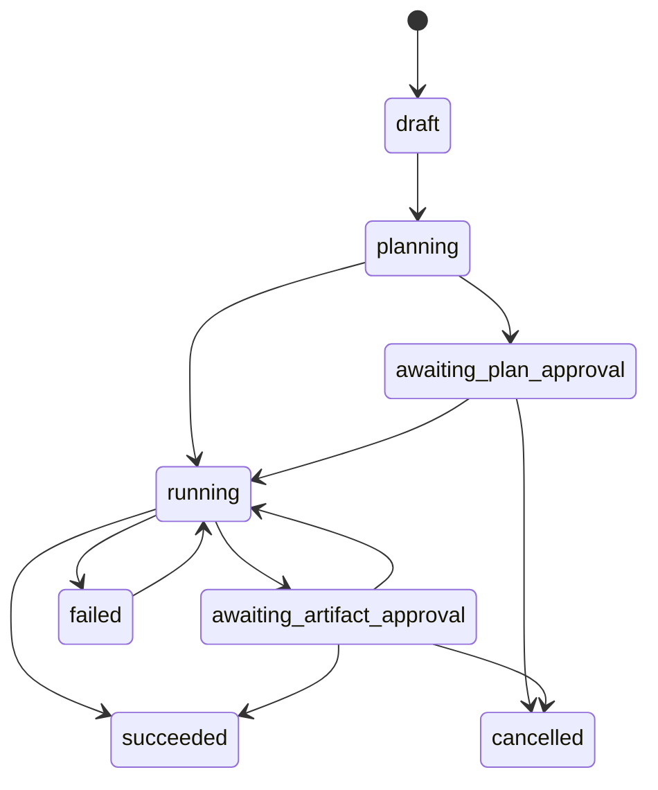
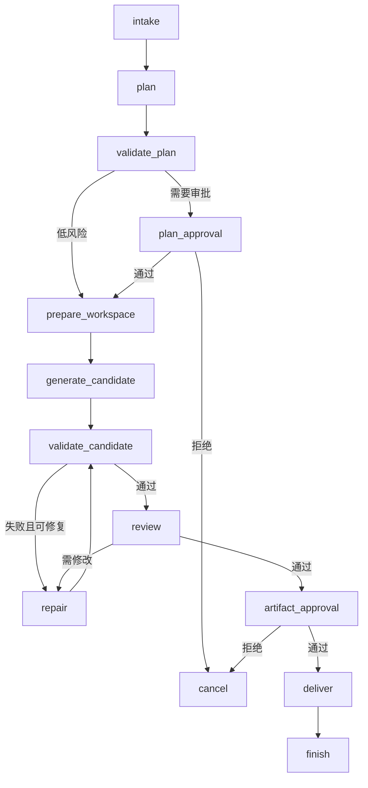

# skill_app 干净底座实施计划

> 本文基于当前 `skill_app` 0.2.0 代码现状制定，目标是把现有的任务、工作流记录、Skill、Tool、Artifact 和 Approval 骨架，逐步实现为可运行、可验证、可扩展的游戏生产 Agent 平台。
>
> 本文是一份代码实施计划，不重复宏观技术愿景。每个阶段均明确修改文件、核心接口、测试与验收条件。

---

## 1. 当前代码基线

当前 `skill_app` 已完成业务清洗，只包含通用底层代码。

```text
skill_app/
├─ main.py
├─ README.md
├─ db/
│  ├─ database.py
│  └─ models.py
├─ domain/
│  └─ status.py
├─ schemas/
│  ├─ approval.py
│  ├─ artifact.py
│  ├─ skill.py
│  ├─ task.py
│  ├─ tool.py
│  └─ workflow.py
├─ services/
│  ├─ skill_loader.py
│  └─ task_service.py
├─ skills/
│  └─ README.md
└─ tools/
   └─ registry.py
```

### 1.1 已有能力

- 创建和查询 `AgentTask`。
- 创建和查询 `WorkflowRun`。
- 注册 Artifact 元数据。
- 创建和处理人工审批。
- 从本地目录发现 Skill。
- 注册和调用内存中的受控 Tool。
- 默认使用独立 SQLite 数据库。
- FastAPI 基础接口可以独立启动。

### 1.2 当前尚未实现

- `WorkflowRun` 目前只是数据库记录，没有实际执行器。
- `StepRun` 已有数据模型，但没有 Service 和 API。
- 没有 LangGraph 工作流。
- 没有 LLM Model Gateway。
- 没有 Planner Agent。
- 没有真实 Tool。
- Artifact 只有元数据，没有文件存储与哈希计算。
- Approval 尚未真正阻断工作流。
- 没有任务事件流、日志和 Trace。
- 没有失败重试、取消、恢复和幂等控制。
- 没有数据库迁移。
- 没有自动化测试目录。
- 没有代码工作区和沙箱。
- 没有策划配置、代码审查、测试或美术等业务 Workflow。

---

## 2. 实施目标

第一阶段的最终可运行闭环定义为：

```text
创建任务
-> Planner 生成结构化计划
-> 创建 WorkflowRun 和 StepRun
-> 在隔离工作区读取项目
-> 生成一个候选 Artifact
-> 执行自动验证
-> 创建人工审批
-> 审批后交付
-> 保存完整事件和评测结果
```

首个业务闭环选择：

> `game_feature`：接收一个游戏功能需求，完成项目分析、计划生成、候选配置或代码补丁生成、自动测试、代码审查和人工审批。

MVP 阶段不追求：

- 自动修改正式工作区。
- 自动提交 Git。
- 多项目远程仓库管理。
- 多个 Agent 自由对话。
- 无限自动返工。
- 直接生成最终商用美术资产。

---

## 3. 实施原则

### 3.1 先完成执行内核，再增加 Agent

没有可靠的状态机、工具权限和产物系统时，新增 Agent 只会增加不可控行为。

实施顺序必须是：

```text
状态与迁移
-> 任务事件
-> Workflow Runtime
-> Tool Runtime
-> Workspace
-> Model Gateway
-> Planner
-> 业务 Workflow
```

### 3.2 Agent 不直接操作数据库

Agent 节点只能：

- 读取 Workflow State。
- 调用 Service。
- 调用受控 Tool。
- 返回结构化结果。

数据库提交、状态转换和 Artifact 注册统一由 Service 层负责。

### 3.3 Tool 不直接决定业务流程

Tool 只执行确定性动作，例如：

- 列举文件。
- 读取文件片段。
- 写入临时工作区。
- 应用补丁。
- 运行测试。
- 校验 JSON Schema。

Tool 不负责：

- 判断下一步调用哪个 Agent。
- 决定任务是否完成。
- 判断是否需要人工审批。

### 3.4 所有生成内容先成为候选 Artifact

任何生成内容不得直接覆盖项目：

```text
模型输出
-> 临时文件
-> Artifact 注册
-> 自动验证
-> Approval
-> 导出或应用
```

---

## 4. 目标目录结构

按阶段逐步演进为：

```text
skill_app/
├─ main.py
├─ api/
│  ├─ tasks.py
│  ├─ workflow_runs.py
│  ├─ artifacts.py
│  ├─ approvals.py
│  ├─ events.py
│  └─ evaluations.py
├─ agents/
│  ├─ base.py
│  ├─ planner.py
│  ├─ config_generator.py
│  ├─ code_generator.py
│  ├─ test_agent.py
│  └─ review_agent.py
├─ workflows/
│  ├─ registry.py
│  ├─ runtime.py
│  ├─ state.py
│  └─ game_feature.py
├─ tools/
│  ├─ registry.py
│  ├─ runtime.py
│  ├─ filesystem.py
│  ├─ patch.py
│  ├─ testing.py
│  └─ config_validation.py
├─ services/
│  ├─ task_service.py
│  ├─ workflow_service.py
│  ├─ step_service.py
│  ├─ event_service.py
│  ├─ artifact_service.py
│  ├─ approval_service.py
│  ├─ evaluation_service.py
│  ├─ workspace_service.py
│  ├─ policy_service.py
│  ├─ model_gateway.py
│  └─ skill_loader.py
├─ domain/
│  ├─ status.py
│  ├─ errors.py
│  └─ transitions.py
├─ db/
│  ├─ database.py
│  ├─ models.py
│  └─ migrations/
├─ schemas/
├─ skills/
├─ policies/
├─ prompts/
├─ tests/
│  ├─ unit/
│  ├─ integration/
│  └─ e2e/
└─ workspaces/
```

---

## 5. Milestone 0：工程基线

预计时间：1～2 天。

### 当前状态

已于 2026-06-18 完成。

完成内容：

- 新增根目录 `pyproject.toml`，配置 Pytest、Coverage 和 Ruff。
- 新增 `skill_app/config.py`，集中管理数据库、Artifact、Workspace、模型 Profile、重试和 Tool 限制。
- 新增 `skill_app/domain/errors.py`。
- 接入 Alembic，并创建六张基础表的初始迁移。
- 新增 Skill Loader、Tool Registry、Settings 和 Task API 测试。
- 测试数据库使用临时 SQLite，不污染正式运行数据库。
- 新增运行数据与测试缓存的 `.gitignore` 规则。

验收结果：

```text
pytest: 15 passed
coverage: 当前底座 94%
ruff: All checks passed
alembic: downgrade base -> upgrade head 验证通过
```

下一实施阶段：Milestone 1——领域状态与事件系统。

### 5.1 目标

建立后续开发必须遵守的测试、配置和迁移基础。

### 5.2 新增文件

```text
pyproject.toml
skill_app/config.py
skill_app/domain/errors.py
skill_app/tests/conftest.py
skill_app/tests/unit/test_skill_loader.py
skill_app/tests/unit/test_tool_registry.py
skill_app/tests/integration/test_task_api.py
```

### 5.3 配置模型

新增 `skill_app/config.py`：

```python
class Settings(BaseSettings):
    app_name: str = "Game Production Agent Platform"
    database_url: str
    artifact_root: Path
    workspace_root: Path
    project_root: Path
    model_profile: str = "local-default"
    max_workflow_retries: int = 2
```

需要集中管理：

- 数据库地址。
- Artifact 根目录。
- Workspace 根目录。
- 默认模型 Profile。
- Tool 超时。
- 文件读取上限。
- 工作流最大重试次数。

`database.py` 不再直接读取环境变量，而是依赖 `Settings`。

### 5.4 数据库迁移

引入 Alembic：

```text
alembic.ini
skill_app/db/migrations/
```

第一份迁移应完整创建：

- `agent_tasks`
- `workflow_runs`
- `step_runs`
- `artifacts`
- `approval_requests`
- `evaluation_results`

之后禁止依赖 `Base.metadata.create_all()` 更新生产表结构。

开发环境可以保留自动初始化，但必须明确仅用于本地测试。

### 5.5 测试配置

在 `pyproject.toml` 中增加：

- Ruff。
- Pytest。
- Coverage。
- Mypy，可在类型稳定后逐步提高严格度。

### 5.6 验收条件

- 测试使用临时 SQLite，不污染项目根目录。
- `pytest skill_app/tests` 通过。
- Skill Loader 对缺失 frontmatter、重复名称有测试。
- Tool Registry 对重复注册和不存在工具有测试。
- Task API 的创建、查询和 404 有测试。
- 数据库可通过迁移创建。

---

## 6. Milestone 1：领域状态与事件系统

预计时间：2～3 天。

### 当前状态

已于 2026-06-18 完成。

完成内容：

- 新增 `skill_app/domain/transitions.py`，集中定义严格任务状态图。
- 同状态转换保持幂等，非法转换统一抛出 `InvalidStateTransition`。
- 新增 `TaskEvent` 数据模型、Schema、Service 和 Alembic 迁移。
- 任务创建、WorkflowRun 创建、Artifact 创建、审批申请、审批处理和任务取消均写入事件。
- 状态修改与对应事件在同一数据库事务中提交。
- 新增 `GET /tasks/{task_id}/events`。
- 新增 `POST /tasks/{task_id}/cancel`。
- 新增统一 DomainError API 响应，`EntityNotFound` 返回 404，非法状态转换返回 409。
- 任务取消支持幂等调用，取消后禁止创建 WorkflowRun。
- 严格区分计划审批和 Artifact 审批：
  - `planning -> awaiting_plan_approval -> running`
  - `running -> awaiting_artifact_approval -> running`
- 计划审批通过前禁止创建 Artifact。
- Artifact 审批会校验 Artifact 存在且属于当前任务。

验收结果：

```text
pytest: 31 passed
coverage: 当前底座 95%
ruff: All checks passed
alembic: upgrade -> downgrade base -> upgrade head 验证通过
```

下一实施阶段：Milestone 2——Workflow Runtime。

### 6.1 目标

让任务状态可解释、可追踪，并阻止非法状态跳转。

### 6.2 重构状态管理

当前 Service 直接赋值：

```python
task.status = TaskStatus.PLANNING
```

改为统一状态转换器：

```text
skill_app/domain/transitions.py
```

建议状态图：



实现：

```python
def transition_task(task: AgentTask, target: TaskStatus) -> None:
    ...
```

非法转换抛出：

```python
class InvalidStateTransition(DomainError):
    ...
```

### 6.3 新增 TaskEvent

在 `db/models.py` 新增：

```python
class TaskEvent(Base):
    id: int
    task_id: str
    workflow_run_id: str | None
    step_run_id: str | None
    event_type: str
    actor_type: str
    actor_name: str
    payload: dict
    created_at: datetime
```

事件示例：

```text
task_created
task_status_changed
workflow_started
step_started
tool_called
tool_completed
artifact_created
validation_completed
approval_requested
approval_resolved
workflow_failed
task_completed
```

### 6.4 新增 Service

```text
skill_app/services/event_service.py
```

接口：

```python
record_event(...)
list_task_events(...)
```

状态修改与事件写入必须处于同一个数据库事务。

### 6.5 新增 API

```http
GET /tasks/{task_id}/events
POST /tasks/{task_id}/cancel
```

### 6.6 验收条件

- 非法状态转换返回 HTTP 409。
- 每次状态变化都有对应 TaskEvent。
- 取消后的任务不能创建新的 WorkflowRun。
- 事件严格按创建顺序返回。
- 同一操作重复请求不会生成冲突状态。

---

## 7. Milestone 2：Workflow Runtime

预计时间：4～6 天。

### 当前状态

已于 2026-06-18 完成。

完成内容：

- 新增 Workflow State、Registry、Runtime 和内置 Workflow 注册机制。
- 新增 `StepRun` Service，实现 `running`、`paused`、`succeeded`、`failed` 生命周期。
- 新增持久化 SQLite LangGraph Checkpoint，不依赖进程内存保存暂停状态。
- 实现首个确定性 `foundation_smoke` Workflow：
  - `initialize`
  - `create_demo_artifact`
  - `request_approval`
  - `wait_for_approval`
  - `finish`
- 工作流会在 `wait_for_approval` 节点通过 `interrupt()` 真实暂停。
- 审批通过后使用 `Command(resume=...)` 从 Checkpoint 恢复。
- 审批拒绝后同步取消 Task 和 WorkflowRun。
- 支持直接取消活动 Workflow，直接取消 Task 时也会同步取消活动 Workflow。
- Workflow 和 Step 的启动、暂停、恢复、成功、失败、取消均写入 TaskEvent。
- Workflow State Snapshot 同步保存到 `WorkflowRun.state_snapshot`。
- 新增 API：
  - `GET /workflows`
  - `POST /tasks/{task_id}/start`
  - `GET /workflow-runs/{run_id}`
  - `GET /workflow-runs/{run_id}/steps`
  - `POST /workflow-runs/{run_id}/resume`
  - `POST /workflow-runs/{run_id}/cancel`
- 已验证关闭并重新创建 TestClient 后，仍能从 SQLite Checkpoint 恢复。
- 已验证节点失败时 StepRun、WorkflowRun 和 AgentTask 均正确记录失败状态与错误。

验收结果：

```text
pytest: 40 passed
coverage: 当前底座 92%
ruff: All checks passed
alembic: upgrade -> downgrade base -> upgrade head 验证通过
```

下一实施阶段：Milestone 3——Artifact 存储。

### 7.1 目标

让 `WorkflowRun` 和 `StepRun` 从数据库记录变成真实执行状态。

### 7.2 新增模块

```text
skill_app/workflows/state.py
skill_app/workflows/registry.py
skill_app/workflows/runtime.py
skill_app/services/workflow_service.py
skill_app/services/step_service.py
skill_app/schemas/step.py
```

### 7.3 Workflow State

```python
class ProductionWorkflowState(TypedDict, total=False):
    task_id: str
    workflow_run_id: str
    request: str
    project_id: str
    plan: dict
    current_step: str
    workspace_id: str
    artifact_ids: list[str]
    validation_results: list[dict]
    review_findings: list[dict]
    retry_counts: dict[str, int]
    approval_id: str | None
    error: dict | None
    final_summary: str
```

### 7.4 Workflow Registry

```python
class WorkflowDefinition:
    name: str
    version: str
    build_graph: Callable
```

需要支持：

- 重复名称检测。
- 指定版本获取。
- 列举可用 Workflow。
- Workflow 不存在时明确失败。

### 7.5 Runtime 接口

```python
start_workflow(task_id, workflow_name)
resume_workflow(workflow_run_id)
cancel_workflow(workflow_run_id)
get_workflow_state(workflow_run_id)
```

### 7.6 最小验证 Workflow

先实现不调用模型的 `foundation_smoke`：

```text
initialize
-> create_demo_artifact
-> request_approval
-> finish
```

它的作用是验证：

- 节点状态记录。
- Artifact 创建。
- 审批暂停。
- 审批后恢复。
- 任务完成。

### 7.7 LangGraph 接入

使用 LangGraph 构建显式图。

第一阶段不允许：

- 动态生成任意节点。
- 模型自由决定图结构。
- 节点无限循环。

每个节点执行前后都应更新 `StepRun`：

```text
pending -> running -> succeeded
                     -> failed
```

### 7.8 Checkpoint

本地开发可以先使用 SQLite Checkpoint；平台数据库迁移到 PostgreSQL 后改为 Postgres Checkpoint。

Checkpoint 中保存图状态，业务数据库保存可查询的运行摘要。两者职责不能混用。

### 7.9 API

```http
GET  /workflows
POST /tasks/{task_id}/start
POST /workflow-runs/{run_id}/resume
POST /workflow-runs/{run_id}/cancel
GET  /workflow-runs/{run_id}
GET  /workflow-runs/{run_id}/steps
```

现有的手动创建 WorkflowRun API 应改为内部接口，用户应通过 `/start` 启动。

### 7.10 验收条件

- `foundation_smoke` 能运行到审批节点并暂停。
- 审批后能从 Checkpoint 恢复。
- 每个节点都有 StepRun。
- 节点异常能正确写入 `error_type` 和 `error_message`。
- 失败任务可以在策略允许时重试。
- 重启服务后仍能恢复未完成 Workflow。

---

## 8. Milestone 3：Artifact 存储

预计时间：2～3 天。

### 当前状态

已于 2026-06-18 完成。

完成内容：

- 新增 Storage Protocol、`StoredObject` 和本地文件存储适配器。
- Artifact 文件按以下结构真实落盘：

```text
.skill_app_data/artifacts/{task_id}/{artifact_id}/{logical_name}
```

- 平台自动生成：
  - `artifact_id`
  - `storage_uri`
  - SHA-256
  - `size_bytes`
  - MIME 类型
  - 版本号
- 新增 `(task_id, logical_name, version)` 数据库唯一约束。
- 新增第三份 Alembic 迁移，增加 `size_bytes` 和 Artifact 版本唯一约束。
- 新增文本 Artifact 与 multipart 文件上传：
  - `POST /tasks/{task_id}/artifacts/text`
  - `POST /tasks/{task_id}/artifacts/upload`
- 新增 Artifact 查询与内容下载：
  - `GET /artifacts/{artifact_id}`
  - `GET /artifacts/{artifact_id}/content`
- 下载前验证文件大小与 SHA-256，发现文件篡改时拒绝返回。
- 实现安全文件名、存储根目录约束和路径逃逸防护。
- 实现最大 Artifact 大小限制。
- 数据库提交失败时自动删除已写入文件，避免半成品。
- `foundation_smoke` 已迁移到真实 Artifact Storage，不再使用 `memory://` 占位。

验收结果：

```text
pytest: 55 passed
coverage: 当前底座约 93%
ruff: All checks passed
alembic: upgrade -> downgrade base -> upgrade head 验证通过
```

下一实施阶段：Milestone 4——Tool Runtime 与权限策略。

### 8.1 目标

让 Artifact 从“用户填写路径和哈希”变成由平台安全创建、存储和验证的真实产物。

### 8.2 新增模块

```text
skill_app/services/artifact_service.py
skill_app/storage/base.py
skill_app/storage/local.py
skill_app/schemas/artifact.py
```

### 8.3 Storage Adapter

```python
class ArtifactStorage(Protocol):
    def put_bytes(...) -> StoredObject: ...
    def put_file(...) -> StoredObject: ...
    def read_bytes(...) -> bytes: ...
    def exists(...) -> bool: ...
```

MVP 实现本地存储：

```text
.skill_app_data/
└─ artifacts/
   └─ {task_id}/
      └─ {artifact_id}/
         └─ {logical_name}
```

### 8.4 Artifact Service

平台自动处理：

- 安全文件名。
- 存储路径。
- SHA-256。
- MIME 类型。
- 版本。
- 文件大小。
- 创建事件。

外部 API 不再允许提交任意 `storage_uri` 和 `sha256`。

新的创建方式：

```http
POST /tasks/{task_id}/artifacts/text
POST /tasks/{task_id}/artifacts/upload
```

内部调用：

```python
create_text_artifact(...)
create_file_artifact(...)
```

### 8.5 Artifact 版本

同一个逻辑名称可以产生多个版本：

```text
npc_rules.yaml v1
npc_rules.yaml v2
npc_rules.yaml v3
```

版本由 Service 自动计算，不能由调用方指定。

### 8.6 验收条件

- 哈希由平台计算。
- Artifact 文件不能逃逸存储根目录。
- 相同逻辑名称能正确递增版本。
- 数据库和文件写入失败时不会留下半成品记录。
- 可以下载或读取 Artifact。
- 删除任务时默认不物理删除 Artifact。

---

## 9. Milestone 4：Tool Runtime 与权限策略

预计时间：4～5 天。

### 当前状态

已于 2026-06-18 完成。

完成内容：

- 将 Tool Registry 重构为定义、Pydantic 输入模型和 Handler 三部分。
- Tool Definition 自动暴露输入 JSON Schema。
- 新增 Tool Context，包含 Task、WorkflowRun、StepRun、Agent、项目根目录、Workspace 和权限。
- 新增 `skill_app/policies/default.yaml` 与 Policy Service。
- Agent 不拥有隐式权限，所有 Tool 必须显式加入 Agent allow list。
- Planner 已验证无法调用 Workspace 写工具。
- 新增受控 Tool Runtime，执行顺序包括：
  - 上下文归属校验
  - 调用审计
  - Tool 查找
  - Agent 权限检查
  - 审批门禁
  - Pydantic 输入校验
  - 超时执行
  - 输出截断
  - 结果文件注册为 Artifact
  - 完成或失败事件
- 所有 Tool 请求，包括未知工具、权限拒绝和输入错误，均产生审计事件。
- 支持 `approval_required` Tool；未批准返回 `approval_required`，批准后才可执行。
- 第一批只读 Tool：
  - `list_project_files`
  - `search_project_text`
  - `read_project_file`
  - `read_file_range`
- 第一批 Workspace Tool：
  - `write_workspace_file`
  - `create_unified_diff`
  - `apply_patch_to_workspace`
- 第一批测试与校验 Tool：
  - `run_pytest`
  - `run_python_compile`
  - `validate_json`
  - `validate_yaml`
  - `validate_json_schema`
- 文件读取默认忽略 Git、虚拟环境、缓存、数据库和二进制资源。
- 项目读取和 Workspace 写入均执行绝对路径归一化与越界检查。
- Workspace 写入产生的文件会自动复制到 Artifact Storage 并注册 Artifact。
- Patch 使用结构化精确文本替换和可选文件哈希锁，不接收任意 Shell。
- Pytest 和 Python Compile 使用结构化参数生成命令，不接收原始命令字符串。
- 子进程和 Handler 均受超时控制，子进程超时会被终止。
- 新增 Tool 执行 API：
  - `POST /tasks/{task_id}/tools/{tool_name}/execute`
- 内置基础 JSON Schema 校验器支持：
  - `type`
  - `required`
  - `properties`
  - `items`
  - `enum`
  - `minimum`
  - `maximum`

验收结果：

```text
pytest: 68 passed
coverage: 当前底座约 92%
ruff: All checks passed
```

下一实施阶段：Milestone 5——Workspace 隔离。

### 9.1 目标

建立 Agent 唯一允许调用外部能力的受控执行层。

### 9.2 重构当前 Tool Registry

当前 Registry 只保存定义和 Handler，后续拆为：

```text
tools/registry.py   # 注册与查询
tools/runtime.py    # 权限、超时、审计、执行
```

### 9.3 Tool Context

```python
class ToolContext(BaseModel):
    task_id: str
    workflow_run_id: str
    step_run_id: str
    agent_name: str
    project_root: str
    workspace_root: str
    permissions: list[str]
```

### 9.4 Tool Runtime

执行流程：

```text
查找工具
-> 校验输入 Schema
-> 检查 Agent 权限
-> 检查副作用等级
-> 必要时要求审批
-> 执行超时控制
-> 截断输出
-> 注册 Artifact
-> 记录 TaskEvent
-> 返回 ToolResult
```

### 9.5 第一批只读工具

```text
list_project_files
search_project_text
read_project_file
read_file_range
```

安全要求：

- 绝对路径归一化。
- 必须位于项目根目录。
- 禁止符号链接越界。
- 默认忽略 `.git`、`.venv`、缓存、数据库和二进制文件。
- 限制单次读取字符数。

### 9.6 第一批执行工具

```text
write_workspace_file
create_unified_diff
apply_patch_to_workspace
run_pytest
run_python_compile
validate_json
validate_yaml
validate_json_schema
```

写操作只能写入 Workspace，不得写入正式项目目录。

### 9.7 Policy

```text
skill_app/policies/default.yaml
skill_app/services/policy_service.py
```

示例：

```yaml
agents:
  planner:
    allow:
      - list_project_files
      - search_project_text
      - read_project_file

  code_generator:
    allow:
      - list_project_files
      - search_project_text
      - read_project_file
      - write_workspace_file
      - create_unified_diff
      - apply_patch_to_workspace

  test_agent:
    allow:
      - read_project_file
      - run_pytest
      - run_python_compile
```

### 9.8 验收条件

- Planner 无法调用写工具。
- 所有 Tool 调用产生事件。
- 超时能返回统一错误。
- 工作区外路径访问被阻止。
- Tool Handler 不能接收原始 Shell 字符串。
- 测试命令由结构化参数生成。

---

## 10. Milestone 5：Workspace 隔离

预计时间：3～4 天。

### 10.1 目标

为每个任务提供独立、可清理、可对比的候选修改空间。

### 10.2 新增模型

```python
class TaskWorkspace(Base):
    id: str
    task_id: str
    source_root: str
    workspace_root: str
    strategy: str
    base_revision: str | None
    status: str
    created_at: datetime
    cleaned_at: datetime | None
```

### 10.3 MVP 策略

当前项目不一定是 Git 仓库，因此先支持：

```text
copy_subset
```

流程：

1. Planner 给出相关文件列表。
2. Workspace Service 复制相关文件和必要依赖。
3. Agent 只修改副本。
4. 生成 Unified Diff。
5. 原项目保持不变。

之后增加：

- Git worktree。
- 临时 clone。
- 容器挂载。

### 10.4 Workspace Service

```python
create_workspace(task_id, source_root, strategy)
copy_files(workspace_id, paths)
resolve_workspace_path(workspace_id, relative_path)
build_diff(workspace_id)
cleanup_workspace(workspace_id)
```

### 10.5 验收条件

- 不允许把 Workspace 建在项目目录之外的任意用户路径。
- 任务之间的 Workspace 完全隔离。
- 修改 Workspace 不影响源文件。
- 能生成可读 Diff Artifact。
- 清理操作不删除 Artifact。

### 10.6 实施状态（2026-06-19）

Milestone 5 已完成。

完成内容：

- 新增正式 `TaskWorkspace` 数据模型和 Alembic 迁移 `20260619_0004`。
- Workspace 物理目录固定为 `.skill_app_data/workspaces/{task_id}/{workspace_id}/`。
- 每个任务同一时间只允许一个 Active Workspace；Tool Runtime 自动创建或复用该工作区。
- 实现 `copy_subset` 策略，并在数据库中保存复制文件清单。
- 复制前统一执行相对路径、越界、符号链接和忽略目录检查。
- Workspace 修改不会写回源项目。
- Diff 同时识别修改、新增、删除和二进制变化。
- Diff 自动注册为 `workspace_diff` Artifact，带 Workspace ID 和变更文件清单。
- 清理前校验数据库路径必须与受管目录精确匹配，拒绝被篡改路径。
- Workspace 清理只删除候选目录，不删除 Artifact Storage。
- 新增 Workspace 创建、查询、复制、Diff 和清理 API。
- Tool Runtime 已从隐式 `task_id/workflow_run_id` 目录切换到正式 TaskWorkspace。

验证结果：

```text
pytest: 73 passed
coverage: 92%
ruff: All checks passed
alembic: 20260618_0003 -> 20260619_0004 upgrade 验证通过
```

下一实施阶段：Milestone 6——Model Gateway。

---

## 11. Milestone 6：Model Gateway

预计时间：3～4 天。

### 11.1 目标

统一管理模型，而不是让 Agent 自行创建客户端。

### 11.2 新增模块

```text
skill_app/services/model_gateway.py
skill_app/schemas/model.py
skill_app/prompts/
```

### 11.3 Model Profile

```python
class ModelProfile(BaseModel):
    name: str
    provider: str
    model: str
    base_url: str | None
    temperature: float
    context_window: int
    supports_tools: bool
    supports_vision: bool
    timeout_seconds: int
```

### 11.4 Gateway 接口

```python
invoke_text(profile, messages, output_schema=None)
invoke_structured(profile, messages, response_model)
stream_text(profile, messages)
```

### 11.5 结构化输出

Planner、Review、Test 等关键 Agent 必须使用 Pydantic 结构化输出。

不能继续采用：

```text
从任意文本中寻找第一个 { 和最后一个 }
```

解析失败时：

1. 保存原始模型输出。
2. 记录 `model_output_validation_failed`。
3. 允许一次格式修复调用。
4. 再次失败则节点失败。

### 11.6 调用记录

增加：

```python
class ModelCall:
    task_id
    step_run_id
    profile_name
    model
    prompt_version
    input_chars
    output_chars
    latency_ms
    status
    error_type
```

初期不必存完整 Prompt，可存 Artifact 或脱敏摘要。

### 11.7 验收条件

- API 请求方不能传任意模型地址。
- Agent 只能选择预定义 Profile。
- 超时、连接失败和结构化解析失败有统一错误。
- 每次模型调用都有耗时和 Profile 记录。
- 单元测试可注入 Fake Model Gateway。

### 11.8 实施状态（2026-06-19）

Milestone 6 已完成。

完成内容：

- 新增 `ModelProfile`、`ModelMessage`、`ProviderResponse` 和 Model Gateway Schema。
- 新增受控 Profile 配置 `skill_app/model_profiles/default.yaml`。
- API 和 Agent 只能提交 `profile_name`，不能提交任意模型地址或客户端配置。
- 新增 Provider 注册表与依赖注入接口。
- 内置确定性 `fake` Provider，供自动化测试和本地开发使用。
- 内置标准 HTTP `openai_compatible` Provider；地址和密钥环境变量由 Profile 管理。
- 实现 `invoke_text`、`invoke_structured` 和 `stream_text`。
- 结构化输出直接使用 Pydantic `model_validate_json`，不再截取任意文本中的 JSON。
- 首次结构化校验失败时保存原始输出 Artifact，并记录 `model_output_validation_failed`。
- 结构化输出仅允许一次格式修复调用；第二次失败抛出统一领域错误。
- 新增 `ModelCall` 数据模型和 Alembic 迁移 `20260619_0005`。
- 每次成功、超时、Provider 失败和结构化失败均保存 Profile、模型、Prompt 版本、字符数、Token、耗时与错误类型。
- 新增 Model Profile 查询、文本调用和任务调用历史 API。
- Provider 可以在测试中注入替身，不需要真实模型或网络。

验证结果：

```text
pytest: 86 passed
coverage: 92%
ruff: All checks passed
alembic: 20260619_0004 -> 20260619_0005 upgrade 验证通过
```

下一实施阶段：Milestone 7——Planner Agent。

---

## 12. Milestone 7：Planner Agent

预计时间：4～5 天。

### 12.1 目标

实现平台第一个真正的 Agent：将用户需求转换为可执行计划。

### 12.2 新增模块

```text
skill_app/agents/base.py
skill_app/agents/planner.py
skill_app/schemas/plan.py
skill_app/prompts/planner/v1.md
skill_app/skills/game-feature-planning/SKILL.md
```

### 12.3 Plan Schema

```python
class PlanStep(BaseModel):
    key: str
    title: str
    agent: str
    skill: str | None
    depends_on: list[str]
    required_tools: list[str]
    expected_artifacts: list[str]
    acceptance_criteria: list[str]
    risk_level: RiskLevel


class TaskPlan(BaseModel):
    goal: str
    task_type: str
    summary: str
    affected_areas: list[str]
    relevant_paths: list[str]
    steps: list[PlanStep]
    global_acceptance_criteria: list[str]
    risk_level: RiskLevel
    requires_plan_approval: bool
```

### 12.4 Planner 执行步骤

```text
读取任务
-> 只读扫描项目结构
-> 搜索相关文件
-> 加载 Planning Skill
-> 构建 Context Pack
-> 调用结构化模型
-> 校验依赖图
-> 保存 Plan Artifact
-> 创建后续 StepRun
-> 根据风险进入审批或执行
```

### 12.5 计划校验

确定性校验包括：

- Step Key 唯一。
- 所有依赖存在。
- 无循环依赖。
- Agent 已注册。
- Tool 已注册。
- Agent 拥有所需 Tool 权限。
- Artifact 类型合法。
- 高风险步骤必须审批。

### 12.6 验收条件

- 对纯文档任务不会规划代码写入。
- 对代码任务必须包含验证或测试步骤。
- 对跨策划、程序、测试任务能生成依赖顺序。
- 非法计划不会进入执行阶段。
- Planner 不能调用写工具。
- 计划保存为 JSON 和 Markdown 两个 Artifact。

### 12.7 实施状态（2026-06-19）

Milestone 7 已完成。

完成内容：

- 新增 `PlanStep`、`TaskPlan` 和 `PlanValidationResult` 严格 Schema。
- 新增 `PlannerAgent`、Agent Context 和版本化 Prompt `planner/v1.md`。
- 新增 `game-feature-planning` Skill，并接入现有 Skill Loader。
- Planner 只读扫描项目结构，生成相关路径、可用 Agent、Tool 和 Skill 的 Context Pack。
- Planner 通过 Model Gateway 的结构化调用生成 TaskPlan。
- 内置确定性基线计划，使 `fake` Provider 也可完整执行 Planner Workflow。
- 纯文档需求不会规划 `code_generator` 或 Workspace 写 Tool。
- 代码需求固定包含生成、自动化验证和审查依赖链。
- 实现确定性计划校验：
  - Step Key 唯一。
  - 依赖存在且无环。
  - Agent 已注册。
  - Tool 已注册。
  - Agent 拥有所需 Tool 权限。
  - Skill 已注册。
  - Artifact 类型合法。
  - 代码任务必须包含测试或验证步骤。
  - 高风险计划必须审批。
- 非法语义计划会使 Workflow 失败，不生成 Plan Artifact，也不登记执行步骤。
- 计划保存为 `plan_json` 和 `plan_markdown` 两个版本化 Artifact。
- 计划中的后续工作会登记为 Pending StepRun，保留 Agent、依赖、Tool、产物和验收标准。
- 新增可执行 `planner@1` LangGraph Workflow。
- 低风险计划验证后直接将任务置为 `running`，等待业务执行 Workflow。
- 高风险计划进入 `AWAITING_PLAN_APPROVAL`，支持持久化暂停、批准恢复和拒绝取消。
- Planner Workflow 成功只代表“计划已就绪”，不会把整个生产任务误标为 `succeeded`。
- 规划阶段只有绑定到运行中 Planner Step 的模型调用被允许。
- Planner 的 Policy 仍只有只读和校验 Tool，无法调用 Workspace 写 Tool。

验证结果：

```text
pytest: 95 passed
coverage: 93%
ruff: All checks passed
alembic: 20260619_0005 remains the single head
```

下一实施阶段：Milestone 8——首个 `game_feature` Workflow。

---

## 13. Milestone 8：首个 game_feature Workflow

预计时间：5～7 天。

### 13.1 目标

实现第一个端到端业务 Workflow。

### 13.2 Workflow 节点



### 13.3 第一版能力边界

第一版 `generate_candidate` 只支持二选一：

1. 生成结构化游戏配置。
2. 生成 Python 代码补丁。

不同时实现 Unity、美术和多语言代码生成。

### 13.4 自动返工

限制为：

```text
同一验证节点最多 2 次修复
```

返工必须携带：

- 上一次 Artifact。
- 验证错误。
- 审查 Finding。
- 已尝试修复摘要。

超过次数：

- Workflow 标记 `failed`。
- 创建人工接管事件。
- 保留所有候选版本。

### 13.5 Deliver

MVP 的交付方式：

- 输出最终 Diff。
- 输出配置文件。
- 输出测试报告。
- 输出审查报告。
- 输出 Manifest。

不自动修改原项目。

### 13.6 验收条件

- 一次任务可产生完整 StepRun 链。
- 自动验证失败时能有限返工。
- 所有候选版本都能查询。
- 审批拒绝后任务正确取消。
- 成功任务拥有最终交付 Manifest。

### 13.7 实施状态（2026-06-19）

Milestone 8 已完成。

完成内容：

- 新增可执行 `game_feature@1` LangGraph Workflow。
- 支持两种启动方式：
  - 从 Draft 任务直接启动，图内完成规划、计划校验与计划审批。
  - 从已完成 Planner Workflow 的 Running 任务启动，复用最新有效 `plan_json`。
- 完整节点链已实现：
  - `intake`
  - `plan`
  - `validate_plan`
  - `plan_approval`
  - `prepare_workspace`
  - `generate_candidate`
  - `validate_candidate`
  - `repair`
  - `review`
  - `artifact_approval`
  - `deliver`
  - `finish`
- 新增 `CandidateSpec`、`CandidateValidation`、`CandidateReview` 和 Review Finding Schema。
- 首版候选生成严格二选一：
  - 结构化 JSON 游戏配置。
  - Workspace 内隔离的 Python 候选模块。
- Candidate Generator 可注入，自动化测试无需真实模型即可稳定模拟修复路径。
- 相关源文件按 Planner 的 relevant paths 复制到正式 TaskWorkspace。
- 所有候选只写入 Workspace 和 Artifact Storage，不修改源项目。
- 每次候选生成都注册独立 Artifact 版本，失败版本不会被覆盖。
- 配置候选执行 JSON、版本字段、功能字段和 settings 结构校验。
- Python 候选执行 AST 语法校验。
- 每次验证生成版本化 `test_report` Artifact。
- 每次审查生成版本化 `review_report` Artifact 和结构化 Finding。
- 验证失败或审查阻断会携带：
  - 上一候选内容和 Artifact。
  - 验证错误。
  - Review Finding。
  - 已尝试修复摘要。
- 自动修复最多 2 次；超过上限：
  - Workflow 和 Task 标记失败。
  - 记录 `manual_takeover_required`。
  - 保留全部候选、验证和审查版本。
- 候选通过验证和审查后进入 Artifact Approval。
- 审批决定会同步更新候选 Artifact 的 `approval_status`。
- 审批拒绝会取消 Task 和 Workflow，不生成交付 Manifest。
- 审批通过后生成：
  - 最终 Workspace Diff Artifact。
  - 最终候选配置或 Python 文件 Artifact。
  - 测试报告清单。
  - 审查报告清单。
  - `delivery_manifest` Artifact。
- Manifest 明确记录 `source_project_modified: false`。
- 高风险任务在同一 Workflow 中依次经过 Plan Approval 和 Artifact Approval。

验证结果：

```text
pytest: 102 passed
coverage: 93%
ruff: All checks passed
alembic: 20260619_0005 remains the single head
```

下一实施阶段：Milestone 9——策划配置生成。

---

## 14. Milestone 9：策划配置生成

预计时间：4～6 天。

### 14.1 目标

实现最适合作为跨岗位展示的第一个生成能力。

### 14.2 新增模块

```text
skill_app/agents/config_generator.py
skill_app/tools/config_validation.py
skill_app/schemas/game_config.py
skill_app/skills/game-config-generator/SKILL.md
skill_app/config_schemas/
```

### 14.3 首个配置类型

推荐使用 NPC 行为规则：

```yaml
schema_version: 1
feature: npc_behavior
rules:
  repeated_question:
    window_seconds: 180
    base_increment: 8
thresholds:
  warning: 60
  refuse: 100
npc_overrides: {}
```

### 14.4 验证器

- YAML 语法。
- JSON Schema。
- 数值范围。
- 枚举。
- 引用完整性。
- 阈值顺序。
- 版本字段。

### 14.5 产物

- 配置 YAML。
- 标准化 JSON。
- Schema 校验报告。
- 策划说明 Markdown。
- 配置 Diff。

### 14.6 验收条件

- 非法阈值能被确定性拦截。
- 同一需求重复生成时字段结构稳定。
- 配置说明能追溯到需求。
- 配置修改必须进入 Artifact Approval。

### 14.7 实施状态（2026-06-19）

Milestone 9 已完成。

完成内容：

- 新增 `NPCBehaviorConfig` 及其嵌套 Pydantic Schema：
  - `RepeatedQuestionRule`
  - `NPCBehaviorRules`
  - `NPCBehaviorThresholds`
  - `NPCOverride`
- 新增版本化 JSON Schema：
  - `skill_app/config_schemas/npc_behavior_v1.json`
- 新增 `NPCBehaviorConfigGenerator` 和 `game-config-generator` Skill。
- `game_feature` 能根据任务语义自动选择 NPC 配置生成分支。
- 配置主候选改为可编辑 YAML：

```yaml
schema_version: 1
feature: npc_behavior
rules:
  repeated_question:
    window_seconds: 180
    base_increment: 8
thresholds:
  warning: 60
  refuse: 100
npc_overrides: {}
npc_groups: {}
```

- Generator 可从中英文需求提取：
  - 重复提问时间窗口。
  - 基础增量。
  - Warning 阈值。
  - Refuse 阈值。
- 同一需求重复生成时字段集合、嵌套结构和顺序稳定。
- 新增确定性 NPC 配置验证器，覆盖：
  - YAML 语法。
  - Schema 字段与类型。
  - `schema_version == 1`。
  - `feature == npc_behavior`。
  - 数值范围。
  - Profile 枚举。
  - `warning < refuse` 阈值顺序。
  - NPC Group 对 Override ID 的引用完整性。
- 配置校验器同时注册为受 Policy 控制的 Tool：
  - `validate_npc_behavior_config`
- Planner、Code Generator、Test Agent、Review Agent 和 Foundation Agent 可按 Policy 调用该 Tool。
- 非法阈值会被验证节点阻断，并进入现有有限 Repair 链。
- Repair 会携带上一版 YAML 和验证错误，确定性修正范围与阈值顺序。
- 每个最终配置任务会产出：
  - `candidate_config`：可编辑 YAML。
  - `normalized_config`：字段排序稳定的标准 JSON。
  - `config_validation_report`：Schema 与业务规则校验报告。
  - `config_explanation`：可追溯用户需求的策划说明 Markdown。
  - `config_diff`：面向策划阅读的配置 Diff。
  - 通用 `workspace_diff`。
  - 最终 `delivery_manifest`。
- 策划说明保存原始需求，并说明窗口、增量和阈值含义。
- Manifest 明确保存所有配置产物 ID。
- YAML 主候选必须经过 Artifact Approval；审批结果同步到候选 Artifact。
- 审批拒绝后不会生成配置交付 Manifest。

验证结果：

```text
pytest: 109 passed
coverage: 93%
ruff: All checks passed
alembic: 20260619_0005 remains the single head
```

下一实施阶段：Milestone 10——代码生成、测试与审查。

---

## 15. Milestone 10：代码生成、测试与审查

预计时间：8～12 天。

这是核心展示阶段，建议拆成三个子里程碑。

### 15.1 Code Generator

新增：

```text
skill_app/agents/code_generator.py
skill_app/skills/code-generator/SKILL.md
skill_app/tools/patch.py
```

输入：

- 用户需求。
- 已批准配置。
- 相关源码。
- 代码规范。
- 目标测试。

输出：

- Unified Diff Artifact。
- 修改说明。
- 影响文件列表。

约束：

- 优先局部补丁。
- 限制最大文件数和修改行数。
- 文件哈希变化时拒绝应用旧补丁。
- 只能应用到 Workspace。

### 15.2 Test Agent

新增：

```text
skill_app/agents/test_agent.py
skill_app/skills/test-generator/SKILL.md
skill_app/tools/testing.py
```

第一版支持：

- Python 编译检查。
- Pytest 定向测试。
- FastAPI TestClient。
- 生成测试补丁。

测试 Agent 输出：

- 测试计划。
- 测试补丁。
- 测试执行报告。
- 未覆盖风险。

### 15.3 Review Agent

新增：

```text
skill_app/agents/review_agent.py
skill_app/skills/code-reviewer/SKILL.md
skill_app/schemas/review.py
```

Finding：

```python
class ReviewFinding(BaseModel):
    severity: Literal["critical", "high", "medium", "low"]
    category: str
    file: str
    line: int | None
    title: str
    evidence: str
    suggestion: str
    blocking: bool
```

审查必须同时参考：

- 用户验收标准。
- 配置 Artifact。
- Diff。
- 测试报告。
- 静态检查结果。

### 15.4 门禁

阻断交付：

- 编译失败。
- 测试失败。
- Critical Finding。
- 配置与代码不一致。
- 修改正式项目的尝试。

警告但不阻断：

- Low Finding。
- 测试覆盖建议。
- 非关键风格问题。

### 15.5 验收条件

- Code Agent 不能绕过 Workspace。
- 自动生成测试至少能捕获一个人为注入的缺陷。
- Review Finding 必须包含证据位置。
- 测试失败会进入 Repair，不能直接请求交付审批。
- 最终 Artifact 包含配置、补丁、测试和审查报告。

### 15.6 实施状态（2026-06-19）

Milestone 10 已完成。

完成内容：

#### Code Generator

- 新增 `CodeGeneratorAgent`、`CodePatch`、`PatchFile` 和 `CodeGenerationResult`。
- 新增 `code-generator` Skill。
- 代码生成严格限制：
  - 单次最多 5 个文件。
  - 单次最多 400 行候选内容。
  - 所有路径必须位于 TaskWorkspace。
  - 修复已有候选时校验规范化 UTF-8 SHA-256。
- 新增结构化 `apply_code_patch` Tool：
  - 不接受原始 Shell 或 Patch 命令。
  - 支持多文件受限写入。
  - 支持 `expected_sha256` 乐观锁。
  - 任一文件哈希不匹配时整批写入前失败。
- Code Generator 输出：
  - `candidate_code`。
  - `code_patch` Unified Diff Artifact。
  - `code_explanation` Markdown。
  - 影响文件列表和修复摘要。
- 代码生成和修复只写入 Workspace；源项目保持不变。

#### Test Agent

- 新增 `TestAgent`、`GeneratedTestPlan` 和 `TestExecutionReport`。
- 新增 `test-generator` Skill。
- 每个 Python 候选都会自动生成：
  - `test_plan`。
  - `test_patch`。
  - `test_report`。
- 真实执行：
  - Python Compile。
  - 定向 Pytest。
  - FastAPI `TestClient` Smoke Test（检测到 FastAPI App 时）。
- 测试报告保存：
  - 编译状态。
  - Pytest 状态。
  - stdout / stderr。
  - 验证错误。
  - 未覆盖风险。
- 自动生成测试已验证能够捕获“代码可编译但 `enabled=False`”的人为行为缺陷。
- 测试失败会直接进入 Repair，不会进入 Review 或 Artifact Approval。

#### Review Agent

- 新增 `ReviewAgent`、`CodeReviewReport` 和独立 Review Finding Schema。
- 新增 `code-reviewer` Skill。
- Review 同时关联：
  - 用户和 Planner 验收标准。
  - 当前 Workspace Diff。
  - Test Report Artifact。
  - 编译与 Pytest 结果。
  - 配置一致性入口。
  - 静态安全检查。
- Finding 包含：
  - Severity。
  - Category。
  - File。
  - Line。
  - Evidence。
  - Suggestion。
  - Blocking。
- Critical / High / Medium 阻断问题会进入 Repair。
- `eval` / `exec`、编译失败、测试失败、无有效 Diff 和配置不一致会阻断交付。
- Low 风险和非关键建议可作为非阻断 Finding 扩展。
- 完整 `CodeReviewReport` 保存为 `review_report` Artifact，并关联测试报告 ID。

#### Workflow 门禁和交付

- `game_feature` 代码分支现按以下顺序执行：

```text
Code Generation
-> Patch/Explanation Artifacts
-> Generated Test Plan/Patch
-> Compile + Pytest
-> Structured Review
-> Artifact Approval
-> Diff + Delivery Manifest
```

- 编译失败、测试失败和阻断 Review Finding 均不能创建最终审批。
- Repair 最多 2 次，且携带上一版本、测试错误、Review Finding 和修复摘要。
- 超限后记录 `manual_takeover_required`，保留全部代码、补丁、测试和审查版本。
- Delivery Manifest 新增：
  - `code_patch_artifact_ids`
  - `code_explanation_artifact_ids`
  - `test_plan_artifact_ids`
  - `test_patch_artifact_ids`
  - `test_report_artifact_ids`
  - `review_report_artifact_ids`
- 配置任务仍保留 Milestone 9 的完整配置产物链。

验证结果：

```text
pytest: 114 passed
coverage: 93%
ruff: All checks passed
alembic: 20260619_0005 remains the single head
```

下一实施阶段：Milestone 11——评测系统。

---

## 16. Milestone 11：评测系统

预计时间：4～5 天。

### 16.1 目标

避免平台只具备演示效果而无法衡量质量。

### 16.2 新增模块

```text
skill_app/services/evaluation_service.py
skill_app/api/evaluations.py
skill_app/evaluations/datasets/
skill_app/evaluations/runners/
```

### 16.3 第一批指标

#### Planner

- 计划结构合法率。
- 必要步骤召回率。
- 无关步骤率。
- 依赖图正确率。

#### Config Generator

- Schema 一次通过率。
- 修复后通过率。
- 人工修改字段数。

#### Code Generator

- 补丁应用率。
- 编译通过率。
- 测试一次通过率。
- 最终通过率。

#### Review Agent

- 已知缺陷检出率。
- 阻断问题准确率。
- 误报率。

#### Workflow

- Task Success Rate。
- First-pass Success Rate。
- 平均返工次数。
- 平均执行时长。
- 人工批准率。

### 16.4 黄金数据

建立小规模人工标注数据：

```text
planning_cases.jsonl
config_cases.jsonl
code_review_cases.jsonl
patch_cases.jsonl
```

每类先做 10～20 条高质量案例，比堆大量低质量数据更有价值。

### 16.5 验收条件

- 能按 Agent、Workflow、模型 Profile 聚合指标。
- 每次版本变更可运行离线回归。
- 指标下降时能够识别具体失败案例。
- 评测结果写入 `EvaluationResult`。

### 16.6 实施状态（2026-06-19）

Milestone 11 已完成。

完成内容：

#### 评测运行与数据模型

- 新增 `EvaluationRun`，保存 Suite、数据集版本、数据集 SHA-256、应用版本、状态、Case 数量和汇总。
- `EvaluationResult` 新增 `evaluation_run_id`，每个 Case 的每项指标仍写入现有结果表。
- 新增 Alembic 迁移 `20260619_0006`。
- 每次离线评测创建独立 Evaluation Task，并记录开始、完成 TaskEvent。

#### 黄金数据集

新增 4 个 JSONL 黄金数据集，每类 10 条，共 40 条：

```text
planning_cases.jsonl
config_cases.jsonl
patch_cases.jsonl
code_review_cases.jsonl
```

- 数据集位于 `skill_app/evaluations/datasets/`。
- 每次运行记录组合 SHA-256 和 Dataset Version。

#### 第一批指标

Planner：

- 计划结构合法率。
- 必要步骤召回率。
- 无关步骤率。
- 依赖图正确率。

Config Generator：

- Schema 一次通过率。
- 修复后通过率。
- 人工修改字段数。

Code Generator：

- Patch 应用率。
- 编译通过率。
- 测试一次通过率。
- 最终通过率。

Review Agent：

- 已知缺陷检出率。
- 阻断问题准确率。
- 误报率。

Workflow 历史：

- Task Success Rate。
- First-pass Success Rate。
- 平均 Repair Count。
- 平均执行时长。
- 人工批准率。
- Model Call Success Rate。

#### 回归对比和失败定位

- 同一 Suite 自动与上一次成功 Run 比较。
- 保存共同指标 Delta。
- 区分“越高越好”和“越低越好”指标。
- 指标下降写入 `summary.comparison.regressions`。
- 失败明细保存 Suite、Case ID 和具体上下文。
- 强制回归测试已验证 API 能定位具体失败 Case。

#### 聚合与 API

新增独立 Router `skill_app/api/evaluations.py`：

```http
POST /evaluations/runs
GET  /evaluations/runs
GET  /evaluations/runs/{run_id}
GET  /evaluations/datasets
GET  /evaluations/aggregate?group_by=agent
GET  /evaluations/aggregate?group_by=workflow
GET  /evaluations/aggregate?group_by=model_profile
```

- Agent 聚合使用 EvaluationResult。
- Workflow 聚合包含成功率、耗时和返工次数。
- Model Profile 聚合包含调用量、平均耗时和平均 Token。

验证结果：

```text
pytest: 121 passed
coverage: 93%
ruff: All checks passed
alembic: 20260619_0006 is the single head
alembic: downgrade 0006 -> 0005 -> upgrade 0006 verified
```

下一实施阶段：Milestone 12——美术资产扩展。

---

## 17. Milestone 12：美术资产扩展

预计时间：6～10 天。

该阶段应在核心程序链路稳定后进行。

### 17.1 新增模块

```text
skill_app/agents/art_brief_agent.py
skill_app/agents/art_asset_agent.py
skill_app/tools/image_generation.py
skill_app/tools/image_validation.py
skill_app/schemas/art.py
skill_app/skills/art-asset-generator/SKILL.md
```

### 17.2 第一版范围

只支持：

- 道具图标。
- UI 图标。
- 概念图草案。

### 17.3 流程

```text
需求
-> Visual Brief
-> Brief 审批
-> 生成多组候选
-> 图片规格验证
-> Contact Sheet
-> 人工选择
-> 导出 Manifest
```

### 17.4 图片 Artifact 元数据

- 模型。
- Prompt。
- Negative Prompt。
- Seed。
- 宽高。
- MIME。
- Alpha。
- 参考图哈希。
- 审核结果。

### 17.5 验收条件

- 未审批 Brief 不调用付费模型。
- 所有图片可追溯到 Prompt。
- 自动校验尺寸、格式和 Alpha。
- 原图与 Contact Sheet 都注册为 Artifact。

### 17.6 实施状态（2026-06-22）

Milestone 12 已完成。

完成内容：

- 新增独立 `art_asset` Workflow，支持道具图标、UI 图标和概念图草案。
- 新增结构化 `VisualBrief`、图片候选、校验结果和交付 Manifest Schema。
- 新增 `art_brief_agent` 与 `art_asset_agent`。
- 新增可注入 Image Provider；自动化测试使用确定性 Fake Provider，不调用付费模型。
- 图片生成通过 Tool Runtime 执行，继承权限、审批、审计、超时和 Workspace 隔离。
- Brief 审批前不会调用 Image Provider。
- 每张候选图记录模型、Prompt、Negative Prompt、Seed、宽高、MIME、Alpha、引用和校验结果。
- 自动校验 PNG 格式、尺寸与 Alpha 要求。
- 候选原图、校验报告、Contact Sheet 和最终 Manifest 均注册为 Artifact。
- 第二道人工审批支持通过 `candidate=<artifact-id>` 选择候选。
- 源项目在整个美术资产工作流中保持不变。
- 本阶段未新增数据库列；图片专属字段使用现有 Artifact JSON 元数据承载，因此无需新增 Alembic 迁移。

验证结果：

```text
pytest: 136 passed
coverage: 93%
ruff: All checks passed
alembic: 20260619_0006 is the single head
```

---

## 18. API 拆分计划

当前全部路由位于 `main.py`，在 Milestone 1 时拆分。

```text
skill_app/api/tasks.py
skill_app/api/workflows.py
skill_app/api/artifacts.py
skill_app/api/approvals.py
skill_app/api/events.py
skill_app/api/evaluations.py
```

`main.py` 最终只负责：

- 创建 FastAPI。
- 注册 Middleware。
- 注册 Exception Handler。
- 注册 Router。
- Lifespan。

建议最终 API：

```http
GET    /health
GET    /skills
GET    /tools
GET    /workflows

POST   /tasks
GET    /tasks
GET    /tasks/{task_id}
POST   /tasks/{task_id}/start
POST   /tasks/{task_id}/cancel
GET    /tasks/{task_id}/events
GET    /tasks/{task_id}/artifacts

GET    /workflow-runs/{run_id}
GET    /workflow-runs/{run_id}/steps
POST   /workflow-runs/{run_id}/resume
POST   /workflow-runs/{run_id}/retry

GET    /artifacts/{artifact_id}
GET    /artifacts/{artifact_id}/content

GET    /approvals
POST   /approvals/{approval_id}/approve
POST   /approvals/{approval_id}/reject

GET    /evaluations
```

---

## 19. 数据库模型后续调整

### 19.1 必须新增

- `TaskEvent`
- `TaskWorkspace`
- `ModelCall`

### 19.2 建议新增唯一约束

```text
StepRun(workflow_run_id, step_key, retry_count)
Artifact(task_id, logical_name, version)
```

### 19.3 建议新增索引

- `AgentTask(project_id, status)`
- `WorkflowRun(task_id, status)`
- `StepRun(workflow_run_id, status)`
- `Artifact(task_id, artifact_type)`
- `ApprovalRequest(task_id, status)`
- `TaskEvent(task_id, created_at)`

### 19.4 时间字段

生产环境统一存 UTC，API 层按 ISO 8601 输出。

当前 `datetime.now()` 应逐步替换为：

```python
datetime.now(timezone.utc)
```

数据库字段改为带时区的 `DateTime(timezone=True)`。

---

## 20. 错误模型

统一领域错误：

```text
DomainError
├─ EntityNotFound
├─ InvalidStateTransition
├─ WorkflowNotFound
├─ WorkflowExecutionError
├─ StepExecutionError
├─ ToolNotFound
├─ ToolPermissionDenied
├─ ToolExecutionError
├─ UnsafePathError
├─ ArtifactStorageError
├─ ApprovalRequired
└─ ModelGatewayError
```

统一 API 响应：

```json
{
  "error": {
    "code": "invalid_state_transition",
    "message": "Task cannot move from cancelled to running.",
    "details": {
      "current": "cancelled",
      "target": "running"
    },
    "trace_id": "..."
  }
}
```

禁止 Service 层依赖 HTTPException。

---

## 21. 测试计划

### 21.1 Unit

- 状态转换。
- Skill 解析。
- Tool 注册。
- Policy 判断。
- 安全路径。
- Artifact 版本与哈希。
- Plan DAG 校验。
- Review Finding Schema。

### 21.2 Integration

- Task Service + SQLite/PostgreSQL。
- Workflow Runtime + Checkpoint。
- Tool Runtime + Workspace。
- Artifact Storage。
- Approval 暂停与恢复。
- Fake Model Gateway。

### 21.3 E2E

场景一：

```text
创建任务
-> foundation_smoke
-> 审批
-> 成功
```

场景二：

```text
生成 NPC 行为配置
-> Schema 失败
-> 自动修复
-> 审批
-> 导出
```

场景三：

```text
生成代码补丁
-> 测试失败
-> 修复
-> Review
-> 审批
-> 输出 Manifest
```

### 21.4 必测安全案例

- `../` 路径逃逸。
- 符号链接逃逸。
- Planner 调用写工具。
- 未审批时执行高风险 Tool。
- 重复审批。
- 已取消 Workflow 恢复。
- Artifact 哈希不匹配。
- 超时 Tool。
- 模型返回非法结构。

---

## 22. 建议开发顺序

### 第一周

1. 工程配置和测试基线。
2. Alembic。
3. 状态转换。
4. TaskEvent。
5. API Router 拆分。

### 第二周

1. Workflow Registry。
2. Step Service。
3. LangGraph Runtime。
4. `foundation_smoke`。
5. Approval 暂停与恢复。

### 第三周

1. Artifact Storage。
2. Workspace。
3. 只读文件 Tool。
4. Tool Runtime 和 Policy。

### 第四周

1. Model Gateway。
2. Fake Model 测试。
3. Planner Agent。
4. Plan Schema 和 DAG 校验。

### 第五周

1. `game_feature` Workflow。
2. Config Generator。
3. YAML/JSON Schema 验证。
4. 配置审批与交付。

### 第六至七周

1. Code Generator。
2. Patch Tool。
3. Test Agent。
4. Review Agent。
5. 自动返工。

### 第八周

1. 离线评测。
2. 指标汇总。
3. 演示数据。
4. 文档和简历项目材料。

美术资产扩展放在核心闭环完成后。

---

## 23. 每个阶段的完成定义

一个 Milestone 只有同时满足以下条件才算完成：

- 代码已实现。
- 数据库迁移已提供。
- 单元测试已覆盖核心分支。
- 至少有一个集成或 E2E 测试。
- API 和 README 已更新。
- 错误场景已验证。
- 没有绕过 Tool Runtime 的直接副作用。
- 没有把业务逻辑重新堆回 `main.py`。

---

## 24. 当前最应该立即实现的代码

从当前底座继续开发时，第一批提交建议严格控制为以下内容：

### Commit 1：工程基线

```text
新增 pyproject.toml
新增 Settings
新增 tests/
增加临时数据库 Fixture
覆盖当前 API、Skill Loader 和 Tool Registry
```

### Commit 2：状态与事件

```text
新增 Domain Error
新增 State Transition
新增 TaskEvent
新增 Event Service
新增 GET /tasks/{id}/events
```

### Commit 3：Workflow 基础

```text
新增 Workflow Registry
新增 Step Service
新增 Workflow Runtime
新增 foundation_smoke
```

### Commit 4：审批恢复

```text
工作流在 Approval 节点暂停
审批后 Resume
拒绝后 Cancel
增加 E2E 测试
```

完成这四个提交后，平台才真正拥有一个可靠的 Agent 工作流内核。

---

## 25. 暂缓实现项

为避免底座再次膨胀，以下内容暂缓：

- Web 前端。
- 用户认证和多租户。
- 自动 Git Push/PR。
- Kubernetes。
- 消息队列和分布式 Worker。
- 多 Agent 自由讨论。
- 大规模向量索引。
- Unity Editor 插件。
- 3D 模型生成。
- 自动上线。

只有在单进程 Workflow、Artifact、Approval 和测试闭环稳定后，才考虑异步 Worker 和分布式执行。

---

## 26. MVP 验收场景

最终 MVP 使用以下需求演示：

> 为游戏增加 NPC 连续追问厌烦规则。不同 NPC 有不同容忍度；生成策划配置、后端候选补丁和测试，但未经人工审批不得修改正式项目。

系统应输出：

1. 结构化计划。
2. 影响文件列表。
3. NPC 行为 YAML 配置。
4. 配置校验报告。
5. Python 候选补丁。
6. 测试补丁。
7. 测试执行报告。
8. 代码审查报告。
9. 人工审批记录。
10. 最终交付 Manifest。

成功标准：

- 源项目在整个过程中保持不变。
- 所有写入只发生在 Workspace 和 Artifact Storage。
- 测试失败不能进入最终审批。
- 审批拒绝后不能交付。
- 服务重启后可以恢复待审批任务。
- 每一步都能通过事件、StepRun 和 Artifact 追踪。

---

## 27. 与总体技术路线的关系

`skill_app_game_production_agent_technical_roadmap.md` 描述的是完整平台愿景；本文描述的是从当前干净底座抵达第一个可用版本的实施顺序。

两份文档分工如下：

| 文档 | 作用 |
|---|---|
| `skill_app_game_production_agent_technical_roadmap.md` | 岗位能力映射、总体架构和长期方向 |
| `skill_app_clean_foundation_implementation_plan.md` | 当前代码起点、提交顺序、文件改造和验收标准 |

后续代码开发应优先以本文的 Milestone 为任务拆分依据，并在每个 Milestone 完成后更新实际状态、偏差和下一步。
